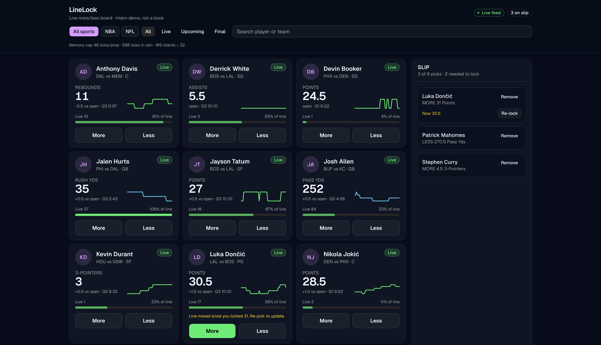
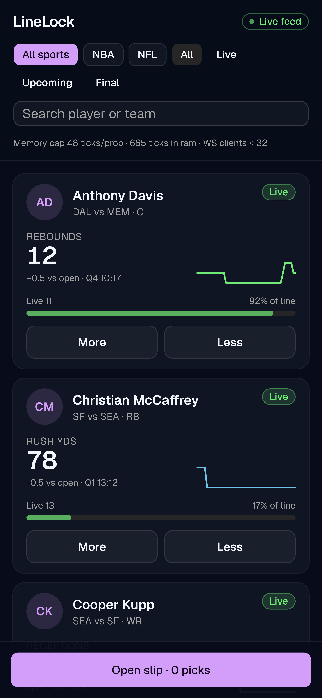

# LineLock

[](https://github.com/cameroncb-dev/linelock/actions/workflows/ci.yml)

Simulated **more/less player-prop board** with live line movement. PrizePicks-shaped intern portfolio: React board, JSON API, live feed, bounded tick memory. Not a sportsbook. No real money. No PrizePicks scraping.



## Why this maps to PrizePicks

PrizePicks interns work React / React Native on the board and slip, and **Ruby on Rails** on APIs. LineLock ships both:

- More/Less cards + 2–6 pick slip
- HTTP snapshot + POST that rejects drifted lines
- Live ticks for lines and stats, paced by a simulated game clock
- Ring buffer of 48 ticks per prop (Node and Rails)
- Slow sockets skipped instead of unbounded queues

**Two backends, one contract.** The UI does not change. `NEXT_PUBLIC_API_ORIGIN` selects Node (default, same origin) or Rails.

| | Node | Rails |
| --- | --- | --- |
| Why it exists | Fast first demo: Next.js + HTTP + `/ws` in one process | PrizePicks-shaped backend: Rails API + Action Cable |
| Port | **43147** | **43148** |
| Live transport | raw WebSocket `/ws` | Action Cable `/cable` **and** the same raw `/ws` JSON as Node |

## Run — Node (default)

Needs **Node 20.9+** (built on 22).

```bash
npm install
npm test          # 33 tests: simulation, slip validation, ring buffer, JSON API
npm run lint      # clean
npm run build     # typechecks and compiles
npm run dev
```

Open [http://127.0.0.1:43147](http://127.0.0.1:43147).

## Run — Rails API + React board

Needs **Ruby 3.3.6** (`backend/.ruby-version`). If you do not already have it:

```bash
# macOS
brew install rbenv ruby-build && rbenv install 3.3.6

# Ubuntu / Debian — rbenv is not packaged, so install it first
sudo apt install -y git curl build-essential libssl-dev libyaml-dev zlib1g-dev
curl -fsSL https://rbenv.org/install.sh | bash
export PATH="$HOME/.rbenv/bin:$HOME/.rbenv/shims:$PATH"
rbenv install 3.3.6
```

Any Ruby 3.2+ runs the suite; 3.3.6 is what `Gemfile.lock` was resolved with. There is no database to set up — the API keeps its whole state in process.

```bash
cd backend
gem install bundler -v 2.5.22   # matches Gemfile.lock; skip if bundle install already works
bundle install                  # add `--path vendor/bundle` if the system gem dir is read-only
bundle exec rspec               # 31 examples
bin/ci                          # setup, RuboCop, specs, bundler-audit, Brakeman
PORT=43148 bin/rails server -b 0.0.0.0
```

In another terminal, point the board at Rails:

```bash
npm run dev:rails-ui
```

That leaves the Node process serving the UI only — it does not start a second simulation.

## Contract

| Method | Path | Purpose |
| --- | --- | --- |
| GET | `/api/health` | Feed + memory stats, and which backend answered |
| GET | `/api/props` | Slate + tick history |
| GET | `/api/props/:id` | One prop |
| GET | `/api/entries` | Last demo slips |
| POST | `/api/entries` | Lock a 2–6 pick slip |
| WS | `/ws` | `{ type: "hello" }` then `{ type: "batch" }` |
| WS | `/cable` | Action Cable `FeedChannel` (Rails only) |

Errors are `{ "ok": false, "error": "..." }` on both backends, plus `drifted` when a line moved; the code is on the HTTP status and nowhere else. The cases are listed in [`contract/error-contract.json`](contract/error-contract.json) and replayed by both test suites, so the two backends cannot quietly drift apart. With both servers running, `./scripts/check-parity.sh` diffs them live.

## Engineering decisions

- **Stats are paced by a game clock.** Props belong to a game, and every prop in it shares one clock. At tip-off each prop draws a projected final total around its line, and a tick may only move the stat as far toward that total as the clock allows. So a prop drifts toward its line across a full game, the More/Less call stays uncertain into the fourth quarter, and nobody finishes with 58 three-pointers. The model lives in [`src/lib/sim.ts`](src/lib/sim.ts) and is mirrored constant for constant in [`backend/app/services/sim.rb`](backend/app/services/sim.rb). A 900 ms tick advances two game seconds, so a 48-minute NBA game plays out in about 21 real minutes; when every game on the slate is final the slate reseeds so a long demo never goes dead.
- **WebSocket / Action Cable:** the Node custom server multiplexes Next, REST and `/ws` in one process. Rails broadcasts ticks through Action Cable (`linelock_feed`) and mirrors the Node JSON on `/ws`, so the React client swaps origins with one env var.
- **Bounded tick history:** `RingBuffer` in TypeScript and `RingBuffer` in Ruby each keep at most 48 ticks per prop. Oldest samples drop; `/api/health` reports the live count.
- **Zustand + stale lines:** locking a pick stores `lockedLine`. Drift shows on the slip, and `POST /api/entries` returns 409 with the drifted prop ids until you re-lock.
- **Backpressure:** a client whose `bufferedAmount` is over 32 KB is skipped for that tick rather than queued.

## Stack

Next.js 16 · TypeScript · Tailwind · shadcn/ui · Zustand · Node (`server.ts` + `ws`) · Rails 8 API · Action Cable · RSpec

## On mobile



## Demo data

NBA and NFL names with **invented** lines, projections and scores. Nothing here comes from a real book.
